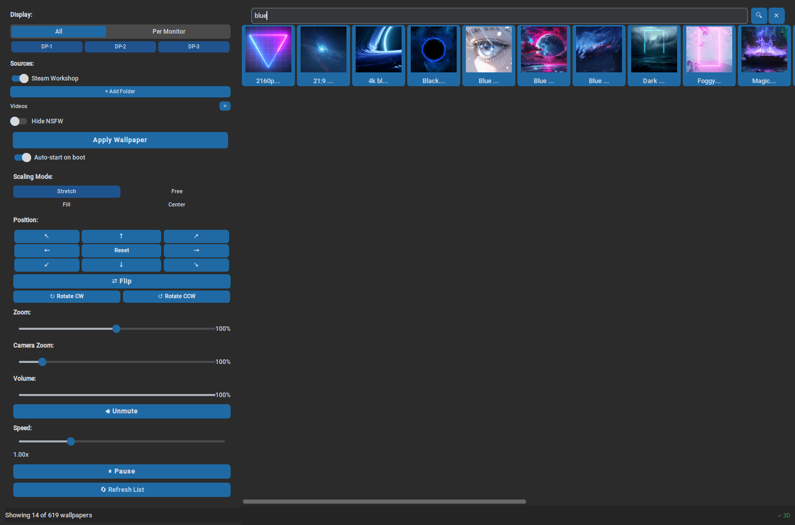

<p align="center">
  
</p>

<p align="center">
  
</p>

<h1 align="center">Tuxpaper Engine</h1>

<p align="center">
  <strong>Animated wallpapers for Linux — browse, tweak, and forget.</strong><br>
  Per-wallpaper settings, multi-monitor support, autostart, and a friendly GUI.<br>
  <em>THERE WILL BE BUGS. Probably some we introduced while fixing the ones we found.</em>
</p>

<p align="center">
  
  
  
  
</p>

---

A desktop app that finds your video wallpapers (Steam Workshop/Wallpaper Engine or local folders),
lets you preview, search, and apply them, and remembers every tweak you make — even across
reboots and multiple monitors.

---

## 🚀 Install (one-liner)

```bash
curl -fsSL https://raw.githubusercontent.com/High-Depth/Tuxpaper/main/install.sh | bash
```

That's it. The script will:
1. Install system packages (`socat`, `meson`, `ninja-build`, `libmpv-dev`, etc.)
2. Build and install [mpvpaper](https://github.com/GhostNaN/mpvpaper) from source
3. Clone Tuxpaper Engine to `~/.local/share/Tuxpaper`
4. Create a Python virtualenv with `customtkinter` + `Pillow`
5. Install a desktop shortcut
6. Ask about autostart on boot
7. Launch the app

To skip the launch at the end (e.g. for scripting), set `SKIP_LAUNCH=1`:

```bash
curl -fsSL https://raw.githubusercontent.com/High-Depth/Tuxpaper/main/install.sh | SKIP_LAUNCH=1 bash
```

### After install

Run from terminal:
```bash
~/.local/share/Tuxpaper/run.sh
```

Or find **Tuxpaper Engine** in your app menu.

---

### 🎨 Scene & Web Wallpapers

Tuxpaper can render scene (3D) and web wallpapers from Wallpaper Engine via
[`linux-wallpaperengine`](https://github.com/Almamu/linux-wallpaperengine).

**Build it:**

```bash
git clone --recurse-submodules https://github.com/Almamu/linux-wallpaperengine.git
cd linux-wallpaperengine
mkdir build && cd build
cmake -DCMAKE_BUILD_TYPE=Release ..
make -j$(nproc)
sudo make install
sudo ln -sf /opt/linux-wallpaperengine/linux-wallpaperengine /usr/local/bin/
```

Video wallpapers (mpvpaper) work fine without it — scene/web wallpapers simply
show as not available until you install the renderer.

---

## 🖥️ Compatibility

| Distro | Status |
|--------|--------|
| Pop!_OS | ✅ Supported (native target) |
| Ubuntu | ✅ Supported |
| Debian | ✅ Supported |
| Linux Mint | ✅ Supported |
| Elementary OS | ✅ Supported |
| Zorin OS | ✅ Supported |
| Kali Linux | ✅ Supported |
| Arch / Fedora / openSUSE / others | ❌ Not yet — install.sh uses `apt` only |

**Display server:** Wayland only. Both mpvpaper (video) and linux-wallpaperengine (scene/web) require the wlroots layer-shell protocol.

**Scene/web wallpaper renderer:** [linux-wallpaperengine](https://github.com/Almamu/linux-wallpaperengine) must be built from source. See [instructions below](#scene-web-wallpapers).

---

## ✨ Features

| Category | What it does |
|----------|-------------|
| **Formats** | Video (`.mp4`, `.webm`), scene (`.pkg`), and web wallpapers — from Steam Workshop or local folders |
| **Browse** | Scan Steam Workshop & local folders; thumbnail grid with scroll |
| **Search** | Filter grid by name on Enter/🔍; ✕ clears; works alongside NSFW filter |
| **NSFW Filter** | Toggle to hide adult wallpapers by tags, content rating (Mature/Questionable), or filename |
| **Grid** | Fixed 20-column grid with uniform thumbnails, horizontal+vertical scroll |
| **Native File Picker** | Uses zenity (GNOME) or kdialog (KDE) for folder selection instead of tkinter |
| **Sources** | Privacy-first — no auto-scan. Toggle Steam Workshop, add/remove local folders, all from sidebar |
| **Scaling** | Stretch, Fit, Fill, or Center — per-wallpaper |
| **Position** | D-pad nudges the wallpaper up/down/left/right |
| **Zoom** | 10%–200% in 5% snap increments |
| **Flip & Rotate** | Mirror horizontally, rotate 90° CW/CCW |
| **Volume** | Slider + mute toggle; auto-unmutes on slider move |
| **Speed** | 0.00x–4.00x playback speed |
| **Pause/Play** | Freeze or resume any wallpaper |
| **Multi-Monitor** | All monitors as one canvas, or individual wallpapers per screen — mode persists across reboots |
| **Mode States** | Each monitor mode ("All" / "Per Monitor") saves its own wallpaper layout independently |
| **Scene/Web** | Scene & web wallpapers rendered via [`linux-wallpaperengine`](https://github.com/Almamu/linux-wallpaperengine) — 3D scenes, interactive wallpapers, full CEF-based web wallpapers |
| **PKG Extract** | `.pkg` archives parsed & extracted to cache automatically for local folder wallpapers |
| **Persistence** | Every setting saved per wallpaper per monitor — restored on re-select and on boot |
| **Reset** | Wipe all saved settings for the current wallpaper back to defaults |
| **Autostart** | Boot-time headless restore reapplies last layout with per-monitor wallpapers |

---

## 🖥️ Multi-Monitor

Tuxpaper Engine auto-detects your connected displays and lets you choose:

- **All** — one wallpaper spans across every monitor as a single canvas
- **Per Monitor** — pick individual wallpapers for each screen

Each monitor gets its own settings (position, zoom, volume, speed, flip, rotation,
scaling mode). Switch between modes any time — settings are remembered per mode.

On boot, every monitor is restored to its last wallpaper with its saved settings,
and your chosen mode (All / Per Monitor) is restored automatically.

---

## 🎮 Usage

### GUI mode

```bash
~/.local/share/Tuxpaper/run.sh
```

### Headless mode (boot / scripting)

Applies the last wallpaper layout without showing the window:

```bash
python3 ~/.local/share/Tuxpaper/tuxpaper.py --headless
```

Toggle **Auto-start on boot** in the GUI to create a login entry that runs
headless mode automatically.

---

## 🎯 Per-Wallpaper Settings

Every wallpaper remembers its own state — per monitor:

- Scaling mode
- Position offset (pan X/Y)
- Zoom level
- Volume %
- Playback speed
- Flip (on/off)
- Rotation (0°/90°/180°/270°)
- Pause state (paused on manual select; playing on boot)

Settings persist as JSON in `~/.config/tuxpaper/` and restore automatically
whenever you re-select a wallpaper.

---

## 📁 Project Structure

```
~/.local/share/Tuxpaper/
├── tuxpaper.py          # Main application
├── launcher.sh          # Launches mpvpaper per monitor (video wallpapers)
├── launcher_scene.sh    # Launches linux-wallpaperengine per monitor (scene/web wallpapers)
├── pkg_extractor.py     # .pkg archive parser & extractor
├── run.sh               # User-friendly runner (venv setup + launch)
├── install.sh           # One-liner installer (deps → mpvpaper → clone → venv → shortcut)
├── install_shortcut.py  # Desktop entry installer
├── icons/
│   └── tuxpaper.svg     # Application icon
├── requirements.txt     # Python dependencies
└── README.md
```

Config lives in `~/.config/tuxpaper/`:

- `settings.json` — app preferences (default scaling, autostart, monitor mode, NSFW filter)
- `last_wallpaper.json` — per-monitor wallpaper restore data (mode + per-monitor info)
- `wallpaper_settings.json` — per-wallpaper-per-monitor settings
- `sources.json` — enabled wallpaper sources (empty by default — privacy-first)

---

## 🐛 There Will Be Bugs

This is a passion project, not a triple-A enterprise deployment platform. Things might go sideways. Your wallpaper might stare at you funny after an update. The config JSON might grow a third eye. If something breaks, [open an issue](https://github.com/High-Depth/Tuxpaper/issues) and we'll squish it together.

Known quirks:
- **Wayland only** — mpvpaper and linux-wallpaperengine both need wlroots. X11 works about as well as a bicycle in a swimming pool.
- **Monitor detection** tries `xrandr` first, then `wlr-randr`. If you're running on a potato with no display server, you get an empty list and a sad trombone sound in spirit.
- **Per-wallpaper custom properties** (sliders, colors, checkboxes from Wallpaper Engine) are set at startup only — linux-wallpaperengine's IPC only knows about 6 keys. Sorry, your 15 custom sliders for "Lava Lamp But With Cats" will stay at defaults.

---

## 📜 Changelog

### v1.5 — "The Bug Hunt"

- **3D Camera Zoom IPC** — `camerazoom` control file key + C++ renderer integration
- **Per-monitor startup** — restores the last active monitor, not every monitor on the planet
- **Wallpaper swap hang fix** — kill by socket path, not by vague `pkill -f` pattern matching
- **Flip-aware positioning** — arrow keys and pan controls reverse direction when wallpaper is flipped
- **10+ race conditions closed** — stale callbacks, IPC file collisions, closure capture bugs, stacked timers
- **I/O debounce** — slider drags no longer melt your SSD with JSON thrash
- **Wayland fallback** — `wlr-randr` detection when `xrandr` is unavailable
- **Broken desktop file fixed** — `~` in `.desktop` files doesn't work, who knew
- **Corrupted JSON backup** — if your config files grow a mustache, they get backed up before being replaced
- **Version-pinned deps** — `customtkinter>=5.2.0`, `Pillow>=10.0.0`

### v1.4 — "Scene/Web Wallpapers"

- Scene and web wallpaper support via `linux-wallpaperengine`
- IPC control file (`/tmp/tuxpaper-{monitor}.ctl`)
- PKG extractor for local `.pkg` files
- Per-wallpaper scaling modes for scene wallpapers

### v1.3 — "Multi-Monitor Mania"

- Per-monitor wallpaper mode with independent settings
- Mode state persistence ("All" vs "Per Monitor")
- Fixed grid and canvas scrollbars
- Fixed wallpaper flicker on startup

### v1.2 — "The Great JSON-ing"

- Per-wallpaper-per-monitor settings persistence
- Settings JSON backed by composite keys (`file_path::monitor`)
- Old-format migration support

### v1.1 — "Cursed Controls"

- Position D-pad, zoom slider, volume, speed, flip, rotate
- Audio toggle with scene wallpaper restart
- Fixed scaling mode flicker

### v1.0 — "It Barely Works"

- Initial release
- Steam Workshop scanning + local folder browsing
- Thumbnail grid with search and NSFW filter
- mpvpaper launcher
- Autostart and headless mode

---

## 📄 License

MIT — do what you like. If you make something cool with it, consider sharing.
